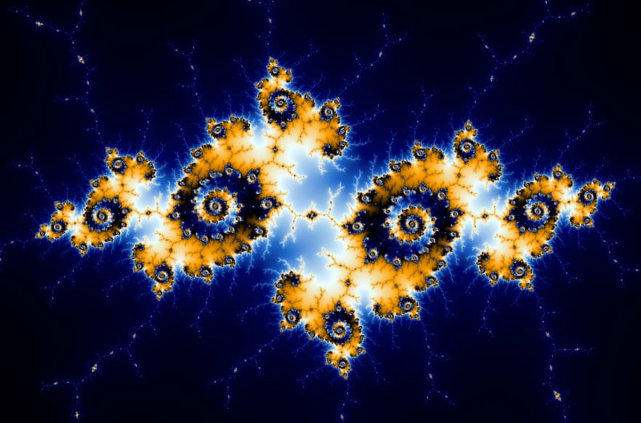

# Generative Art

Generative art can be an intimidating topic — it seems like there is a lot of math involved, and art is tricky in itself!

But, it doesn’t have to be difficult — you can build some really cool things without a math or art degree. 

## What is Code Art?

Code art is any art that is built using code.

## What is generative art?

Often, generative art draws inspiration from modern art, especially pop art that makes heavy use of orderly geometric patterns.

However, it is a very broad and rich category of art created with code with a central characteristic. Generative art incorporates a self-governed or autonomous system in some way.

Randomness is one type of autonomous system. By incorporating chance into a piece of code art, you get a different, completely unique piece of art each time you run your script, load your page, or respond to some user interaction.

There are also more orderly autonomous systems. One example is Mandelbrot’s Fractal, derived from a deceptively simple equation.

We can also integrate both approaches, blending order and chaos!

The artwork becomes a collaboration between the computer and the artist. Some aspects of the artwork are controlled by the coder, but not all of them. The artist controls both the randomness and the order in the art.

In a way, with an autonomous system, the artist gives up control over their art, and the computer is doing it for them. A more nuanced perspective emerges when a new creative process is considered.

The coder-artist engages in a feedback loop where they are constantly tweaking a system to produce more desirable and often more surprising results.

This process embraces experimentation and happy accidents in a way that reshapes the role of the artist. Generative artists, use the code basics like loops, control flow and specialized functions. We then blend them with often unpredictable forces, to produce completely unique results unlike anything else that exists.

## The Challenge

This is a kind of more creative challenge. We defy you to make the greatest and creative pice of generative art you can. With all the resources that you want to use. 

### Instructions

Please specify the dependencies in some place so we can install and execute your program.
